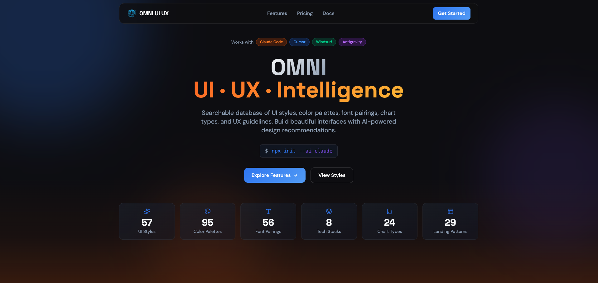

# Cross-Platform UX Kit

An AI skill that provides design intelligence for building professional UI/UX across multiple platforms and frameworks.

<p align="center">
  
</p>

## Overview

Cross-Platform UX Kit is a searchable database of UI styles, color palettes, font pairings, chart types, product recommendations, UX guidelines, shadcn/ui components, animations, effects, and stack-specific best practices. It works as a skill/workflow for AI coding assistants (Claude Code, Codex, Cursor, Windsurf, etc.).

## Features

- **70+ shadcn/ui Components** - Complete component library with variants, props, and accessibility specs
- **45 Animation Patterns** - Tailwind Animate + Framer Motion patterns
- **60 UI Effects** - Hover, focus, loading, transitions, and micro-interactions
- **57 UI Styles** - Glassmorphism, Claymorphism, Minimalism, Brutalism, Neumorphism, Bento Grid, Dark Mode, and more
- **95 Color Palettes** - Industry-specific palettes for SaaS, E-commerce, Healthcare, Fintech, Beauty, etc.
- **56 Font Pairings** - Curated typography combinations with Google Fonts imports
- **24 Chart Types** - Recommendations for dashboards and analytics
- **12 Tech Stacks** - React, Next.js, Vue, Nuxt.js, Nuxt UI, Svelte, SwiftUI, React Native, Flutter, HTML+Tailwind, shadcn/ui, Electron
- **Cross-Platform Patterns** - Navigation, feedback, data-display patterns for Web, Electron, SwiftUI, React Native, Flutter
- **Design Tokens** - Spacing, typography, color, motion tokens in JSON format
- **98 UX Guidelines** - Best practices, anti-patterns, and accessibility rules

## Installation

### Using CLI (Recommended)

```bash
# Install CLI globally
npm install -g cross-platform-ux-kit

# Go to your project
cd /path/to/your/project

# Install for your AI assistant
uxkit init --ai claude      # Claude Code
uxkit init --ai cursor      # Cursor
uxkit init --ai windsurf    # Windsurf
uxkit init --ai copilot     # GitHub Copilot
uxkit init --ai kiro        # Kiro
uxkit init --ai codex       # Codex (Skills)
uxkit init --ai gemini      # Gemini CLI
uxkit init --ai all         # All assistants
```

### Other CLI Commands

```bash
uxkit versions              # List available versions
uxkit update                # Update to latest version
uxkit init --version v1.0.0 # Install specific version
```

### Manual Installation

Copy the appropriate folders to your project:

| AI Assistant   | Folders to Copy                                                     |
| -------------- | ------------------------------------------------------------------- |
| Claude Code    | `.claude/skills/cross-platform-ux-kit/`                                     |
| Cursor         | `.cursor/commands/cross-platform-ux-kit.md` + `.shared/cross-platform-ux-kit/`      |
| Windsurf       | `.windsurf/workflows/cross-platform-ux-kit.md` + `.shared/cross-platform-ux-kit/`   |
| GitHub Copilot | `.github/prompts/cross-platform-ux-kit.prompt.md` + `.shared/cross-platform-ux-kit/`|
| Kiro           | `.kiro/steering/cross-platform-ux-kit.md` + `.shared/cross-platform-ux-kit/`        |
| Codex          | `.codex/skills/cross-platform-ux-kit/`                                     |
| Gemini CLI     | `.gemini/skills/cross-platform-ux-kit/` + `.shared/cross-platform-ux-kit/`         |

## Prerequisites

Python 3.x is required for the search script.

```bash
# Check if Python is installed
python3 --version

# macOS
brew install python3

# Ubuntu/Debian
sudo apt update && sudo apt install python3

# Windows
winget install Python.Python.3.12
```

## Usage

### Claude Code

The skill activates automatically when you request UI/UX work. Just chat naturally:

```
Build a landing page for my SaaS product
```

### Cursor / Windsurf

Use the slash command to invoke the skill:

```
/cross-platform-ux-kit Build a landing page for my SaaS product
```

### Kiro

Type `/` in chat to see available commands, then select `cross-platform-ux-kit`:

```
/cross-platform-ux-kit Build a landing page for my SaaS product
```

### GitHub Copilot

In VS Code with Copilot, type `/` in chat to see available prompts, then select `cross-platform-ux-kit`:

```
/cross-platform-ux-kit Build a landing page for my SaaS product
```

### Codex CLI

The skill activates automatically for UI/UX requests. You can also invoke it explicitly:

```
$cross-platform-ux-kit Build a landing page for my SaaS product
```

### Gemini CLI

The skill activates automatically when you request UI/UX work.

```
Build a landing page for my SaaS product
```

### Example Prompts

```
Build a landing page for my SaaS product

Create a dashboard for healthcare analytics

Design a portfolio website with dark mode

Make a mobile app UI for e-commerce

Build a command palette for an Electron app
```

### How It Works

1. **You ask** - Request any UI/UX task (build, design, create, implement, review, fix, improve)
2. **Skill activates** - The AI automatically searches the design database for relevant styles, colors, typography, and guidelines
3. **Smart recommendations** - Based on your product type and requirements, it finds the best matching design system
4. **Code generation** - Implements the UI with proper colors, fonts, spacing, and best practices

### Supported Stacks

The skill provides stack-specific guidelines for:

- **HTML + Tailwind** (default)
- **React** / **Next.js** / **shadcn/ui**
- **Vue** / **Nuxt.js** / **Nuxt UI** / **Svelte**
- **SwiftUI** / **React Native** / **Flutter**
- **Electron** (desktop apps)

Just mention your preferred stack in the prompt, or let it default to HTML + Tailwind.

## Star History

[](https://star-history.com/#Blvckjs96/Cross-Platform-UI-UX-Kit&Date)

## License

This project is licensed under the [MIT License](LICENSE).
